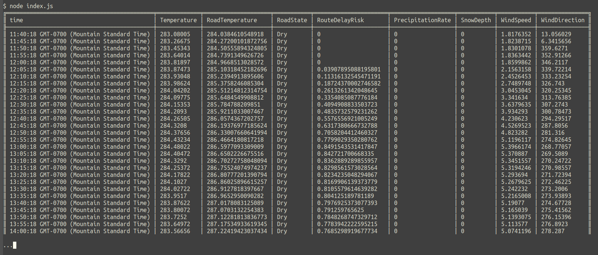

# Overview

A node application demonstrating using the Forecast API to get a forecast for a single point through time.

## Usage

```
$ npm install
$ export FORECAST_API_KEY=your-forecast-api-key
$ node index.js
```

Hopefully you see something like:


